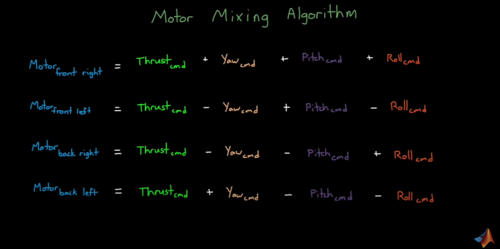

# Aerothon-cse
  
## Overview : 

We, the Control System team, work on the simulation and the software system that allows our quadcopter to be controlled remotely and operable autonomously. 
Our mission is to provide a robust, reliable and modular software elements to implement different functions of our drone that enables basic flight, fail safes, payload delivery and autonomy. Using concepts of we tailor each of the algorithms to achieve stable and time efficient flight.

## Hardware and Firmware : 

We analyzed some of top drone controllers of the market by gathering information for factors like:
1. Affordability
2. Open Source Firmware
3. FPV Racing friendly
4. Autonomous functionality
5. Linux or microcontroller based environment
6. Typical frame size
7. Popularity (Higher popularity means more online resources and help)
8. Processor

                                                                 COMPARING BOARDS 

|  Board        |   Weight (in gms)  | Open Source Firmware                |  FPV  |  Autonomous Functionality  |  Typical Frame Size  |  Popularity  |  Processor  |
| ---------     |  ----------------  |  -------------------                |  ---  |  ------------------------  |  ------------------  |  ----------  |  ---------  |
|  Pixhawk      |      39            | ArduPilot, PX4                      |  Yes  |         Yes                |   82 x 16 x 50 mm    |   High       | 32          |   
|     CC3D      |       9            |  CleanFlight,BetaFlight,ArduPilot   |  Yes  |         Yes                |   40 x 40 x 18       |   High       | 32          |
|  Navio2       |       23           |  ArduPilot,PX4                      |  No   |         Yes                |   55 x 65 mm         |   Medium     |  32         |
|               |                    |                                     |       |                            |                      |              |             |

                                                          
                                                          
                                                          
   COMPARING ArduPilot and PX4
                                                                                                                 

  | Specifications  |  ArduPilot    |  PX4  |
  |:---             |:---           |:---   |
  |License          |  GPL          |  BSD  |
  | Sources         |  Open-Source  | Open-Source|
  | Form-Factor     | High          |High   |
  

**The main difference between Ardupilot and PX4 arises in License Factor. GPL ( General Public License) is a copy left open-source license. This means that all derivatives of Ardupilot must also be released in GPL. Where PX4 is BSD (Berkeley Source Distribution) for which we don't have to openly release the source.**

***Based on the above data, we've decided to use Pixhawk along with PX4***

### We are going to build a drone which can switch between autonomous and RC mode
The switching of the drone modes is facilitated by the Pixhawk flight controller.
Our drone will have some features it can execute in the RC mode and some in the autonomous and some of the features are going to be common for both the modes like **Altitude hold**, **Fail - safe** and **Geofencing**, In the next section of the document, we dive deeper into the different control systems and algorithms of the following features.
 
All of the features we are going to implement is either an inbuilt feature in the pixhawk's px4 firmware or one's that we are going to Develop using the Dronekit library.
 
Both the methods abstract the individual speed control of the motors using the motor mixing algorithm and have the PID controllers which will take care of all the differential equation involved and gives output to the **mma** based on the command and the state of the drone.

# Features of drone
R C Controlled : 

1. Throttle
2. Pitch 
3. Roll
4. Yaw
5. Altitude hold
6. Hover
7. Geographical fence

 

> **1. Throttle**

 

>Throttle is just a upward (or downward) movment of quadcopter which can be achived by increasing (or decreasing) all the propeller speeds by the same amount. It leads to a vertical force with respect to body-fixed frame which raises or lowers the quad-rotor.

 

> **2. Pitch**

 

>The second dimension an aircraft can move in is called “pitch.” The pitch means the drone tilts upwards or downwards based on its orientation and the location of its nose. A downwards tilt will move the aircraft (drone in this case) in a forwards motion, while an upwards tilt will move it backwards.

 

> **3. Yaw**

 

>“yaw” refers to the direction the front of your drone (or even a plane or car) is facing when rotating either clockwise or counterclockwise (or left and right if you prefer) on its vertical axis.
 

> **4. Roll**

 
>"Roll" Refers to the rotation of the drone along the axis that connects head to tail of the drone.
  

> **5. Hover**
 

>two of a drone's four rotors move clockwise, while the other two move counterclockwise, ensuring that the sideways momentum of the drone remains balanced.

 

 > **6. Geographical fence**

 

>This is the use of GPS to create a virtual boundary that triggers a predetermined response when the drone flies into — or out of — a particular area. If the drone flies towards a “fenced” or restricted area, it will stop mid-flight. If you try to take off from a restricted area, the drone will not start up at all. Geofences can be placed to keep drones out of certain fields, from flying over a particular building, and prevent them from entering into “no fly zones.”

 
 

## Control systems of the features : 
All the features of the drone can be accomplished by a applying closed loop control system.
<the main control system of the RC mode : >
In RC mode, the basic degrees of freedom can be accomplished where the feedback and the correction of the motor speed values can be provided by the end user (pilot) where he controls the drone by flying it in a FPV mode.   

 
However due to the restraints provided by the Aerothon Competition, we find it best to have an autonomous mode **Altitude hold**, when it is switched ON, the drone will autonomously stay in the same altitude while executing the actions the pilot provides in all the other axis. We would also like to have another switchable autonomous **hover** mode for the drone which will help us performing the most important objective of the flying competition which is **Delivery of the payload** as close to the Bull's eye as possible.   
For this we might need to calculate the possible trajectory of the projectile and the as there are points alloted for dropping as close to the bull's eye as possible, we find it best to automate the Dropping process too and eyeball it.    
As we approach the Bull's eye in the RC mode, we will hover over its approximated position and switch to the autonmous **Delivery Process**, after the payload is delivered or dropped at the height of 20m over the Bull's eye, we switch back to RC mode and return to base following the objective of the PHASE II flying competition.
